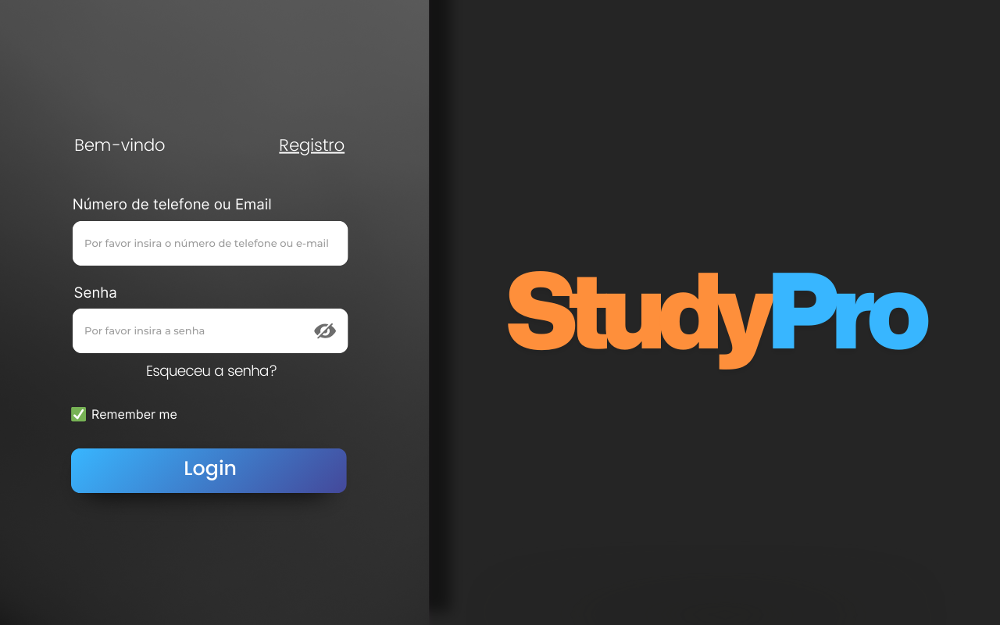
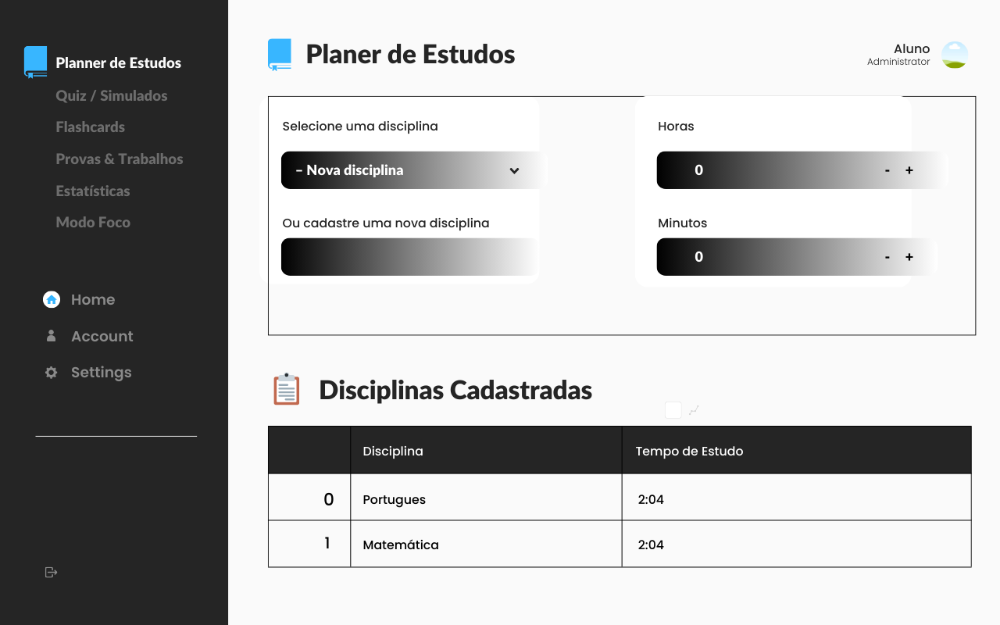
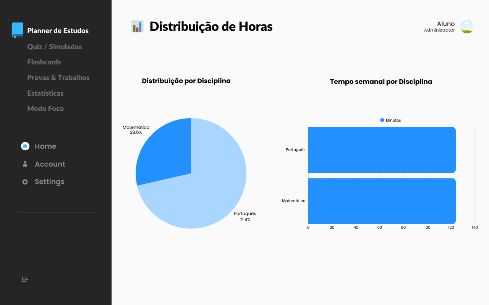
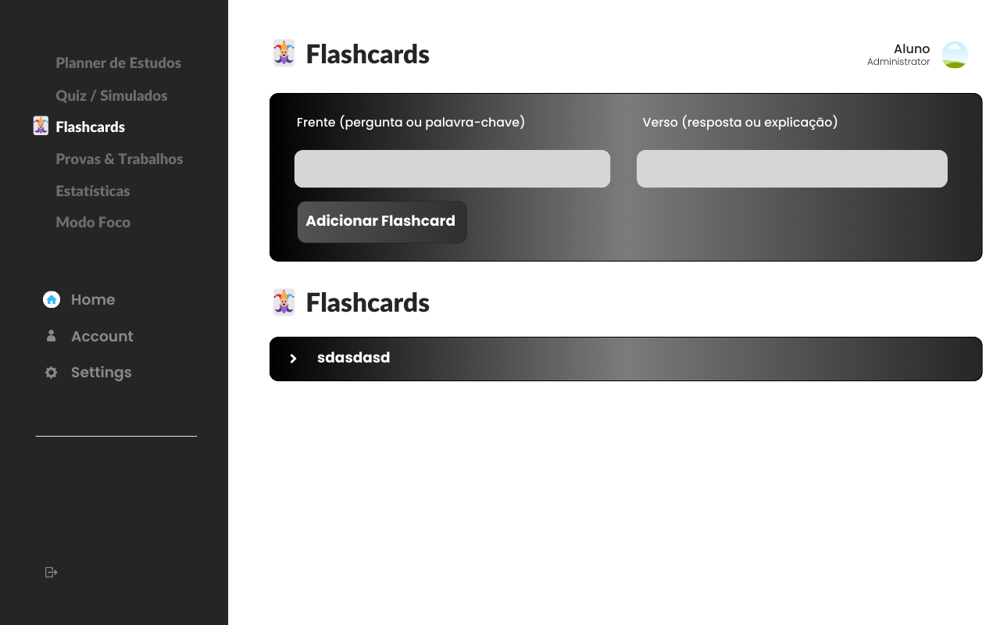
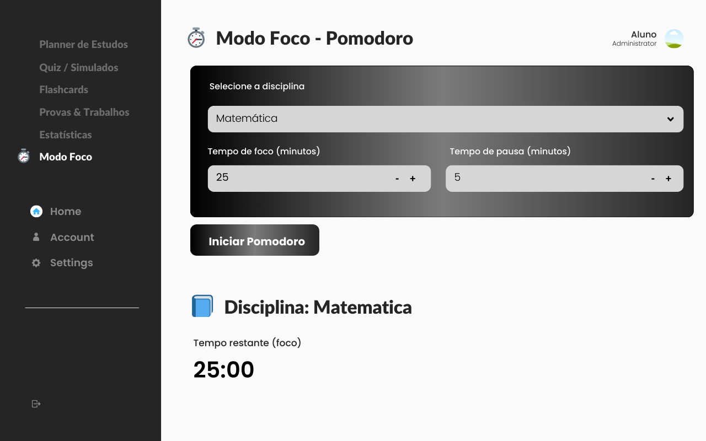

# 📚 Aplicativo de Estudos com Streamlit

Este projeto faz parte de um trabalho acadêmico e tem como objetivo o desenvolvimento de um **aplicativo web para organização de estudos**, utilizando **Python, Streamlit e SQLite**.

A aplicação segue o modelo **multi-page**, permitindo acesso a diferentes funcionalidades de forma organizada.

## 🌐 Acesso Online

A aplicação está disponível na nuvem do Streamlit e pode ser acessada diretamente pelo navegador:

**🔗 [Acessar Aplicação Online](https://studyapp-projeto-integrador.streamlit.app/Planner_de_Estudios)**

## 🚀 Funcionalidades Implementadas

### 📘 Planner de Estudos
- Cadastro e atualização de disciplinas.
- Definição de horas e minutos semanais para cada disciplina.
- Visualização em tabelas e gráficos interativos (pizza e barras).
- Dados armazenados no banco SQLite.

### 📝 Quiz/Simulados
- Perguntas de múltipla escolha já cadastradas (exemplo com 10 perguntas de tecnologia).
- Correção automática após finalização do quiz.
- Histórico de tentativas armazenado no banco (pontuação, data, total de questões).
- Gráficos de evolução (linha) e desempenho por disciplina (barras).
- 🔮 **Futuro**: integração com **IA via API**, permitindo que o usuário informe um tema e o sistema gere automaticamente perguntas.

### 🃏 Flashcards
- Estrutura inicial para criação e revisão de flashcards digitais.
- Possibilidade de expansão para algoritmos de repetição espaçada.

### ⏱️ Modo Foco (Pomodoro)
- Timer configurável de foco e pausa.
- Registro das sessões no banco de dados (disciplina, duração, horário de início e fim, status).
- Histórico de sessões exibido em tabela para análise futura.

## 🛠️ Tecnologias Utilizadas

- Python 3
- Streamlit
- SQLite (via SQLAlchemy)
- Pandas
- Plotly Express

## 📂 Estrutura do Projeto

```
StudyApp/
│── app.py                     # Arquivo principal com navegação multi-page
│── pages/
│   ├── planner.py              # Planner de Estudos
│   ├── quiz.py                 # Quiz e Simulados
│   ├── flashcards.py           # Flashcards
│   └── pomodoro.py             # Modo Foco (Pomodoro)
│── utils/
│   ├── storage.py              # Definição das tabelas e conexão SQLite
│   ├── seed_data.py            # Função para popular perguntas de exemplo
│   └── helpers.py              # Funções auxiliares (ex: conversão de horas/minutos)
│── data/
│   └── estudos.db              # Banco SQLite (ignorado pelo Git)
│── .gitignore
└── requirements.txt            # Dependências do projeto
```

## ⚙️ Como Executar o Projeto

### 1. Clone este repositório

```bash
git clone https://github.com/silvestre00/StudyApp-Projeto-Integrador
cd StudyApp-Projeto-Integrador
```

### 2. Crie um ambiente virtual e ative-o

```bash
python -m venv venv
source venv/bin/activate   # Linux/Mac
venv\Scripts\activate      # Windows
```

### 3. Instale as dependências

```bash
pip install -r requirements.txt
```

### 4. Execute a aplicação

```bash
streamlit run app.py
```

### 5. Acesse no navegador

```
http://localhost:8501
```

## 🎯 Próximos Passos

- Expandir **base de perguntas** e permitir **integração com IA** para geração dinâmica.
- Melhorar sistema de **flashcards com repetição espaçada**.
- Criar **dashboard unificado** com relatórios de desempenho.
- Incluir **análises de tempo de estudo** integrando Planner + Pomodoro.
- Suporte para exportar relatórios em PDF/Excel.


## 🎨 Protótipo

Abaixo estão algumas telas iniciais do protótipo do sistema.  
*(As imagens estão armazenadas na pasta `assets/images/` do repositório.)*









## 👥 Equipe do Projeto

Projeto desenvolvido como parte do Projeto Integrador Senac (Grupo 39):

- **Silvestre Alves**
- **Valter Paulino**
- **Vinicius Luscri**
- **Vitor Alves**
- **Tiago Sampaio**

## 📄 Licença

Este projeto é de uso acadêmico. Sinta-se livre para clonar e melhorar.
